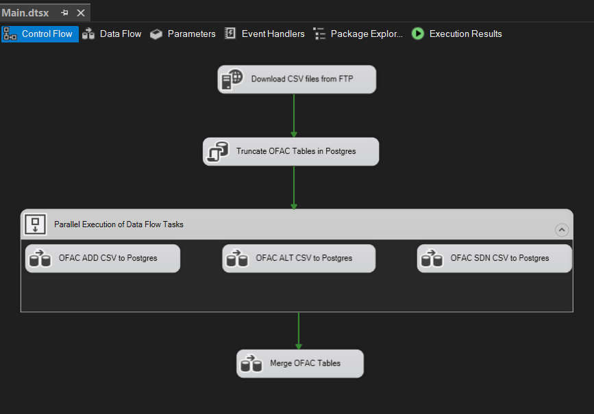
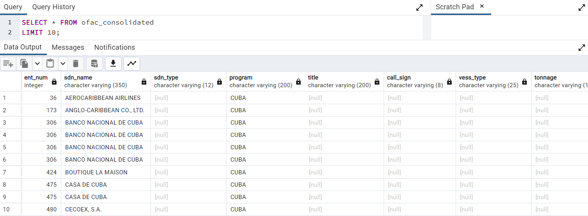

# FTP Server to Postgres Data Pipeline

by yourstrulyhb

## 🛠 About the project 🛠

 
   <br> <br>
A project on how to create a SSIS data pipeline which transfers CSV files from FTP server to a Postgres database.

This project is an output from following the 4th episode of 𝗕𝘂𝗶𝗹𝗱𝗶𝗻𝗴 𝗬𝗼𝘂𝗿 𝗙𝗶𝗿𝘀𝘁 𝗘𝗻𝗱-𝘁𝗼-𝗘𝗻𝗱 𝗗𝗮𝘁𝗮 𝗣𝗼𝗿𝘁𝗳𝗼𝗹𝗶𝗼 series by [Sir Josh Dev](https://www.facebook.com/profile.php?id=100087019650476).

## 🌐 Data Source 🌐

- OFAC data: https://ofac.treasury.gov/specially-designated-nationals-list-data-formats-data-schemas

## 🛢️ Postgres Tables 🛢️

- **OFAC_SDN.CSV** --> **stg_ofac_sdn**

  ```
  SELECT * FROM stg_ofac_sdn
  LIMIT 10;
  ```

   
   <br> <br>

- **OFAC_ADD.CSV** --> **stg_ofac_add**

  ```
  SELECT * FROM stg_ofac_add
  LIMIT 10;
  ```

    
   <br> <br>

- **OFAC_ALT.CSV** --> **stg_ofac_alt**

  ```
  SELECT * FROM stg_ofac_alt
  LIMIT 10;
  ```

  
   <br> <br>

- **ofac_consolidated**
  ```
  SELECT * FROM ofac_consolidated
  LIMIT 10;
  ```
  
     <br> <br>

## 📑 Reference Documentations: 📑

- OFAC CSV Files Metadata: https://ofac.treasury.gov/media/29976/download?inline
- SSIS FTP Connection Manager: https://learn.microsoft.com/en-us/sql/integration-services/connection-manager/ftp-connection-manager?view=sql-server-ver16
- SSIS Flat File Connection Manager: https://learn.microsoft.com/en-us/sql/integration-services/connection-manager/flat-file-connection-manager?view=sql-server-ver16
- ODBC: https://insightsoftware.com/blog/what-is-odbc/

## ✍ TODO:

- [ ] Add OFAC_CONS CSV files into Postgres
  - [ ] Create tables for OFAC_CONS CSV files
  - [ ] Consolidate data from OFAC_CONS CSV files
- [ ] Deploy SSIS project
  - [ ] Create SSIS Catalog
    - https://learn.microsoft.com/en-us/sql/integration-services/catalog/ssis-catalog?view=sql-server-ver16
    - https://azureops.org/articles/create-ssis-catalog/
